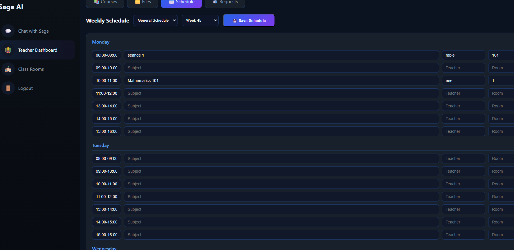

# Class AI Assistant (Sage)

[](https://opensource.org/licenses/MIT)
[](https://www.python.org/)
[](https://developer.mozilla.org/en-US/docs/Web/JavaScript)
[](https://developer.mozilla.org/en-US/docs/Web/HTML)
[](https://developer.mozilla.org/en-US/docs/Web/CSS)
[](https://www.tensorflow.org/)
[](https://openai.com/)
[](https://scikit-learn.org/)

An AI-powered web application designed to assist teachers with educational tasks through Sage (Class Assistant AI), a chatbot that provides personalized teaching strategies, lesson plans, and educational resources. Now with **advanced natural language processing** and **Wikipedia integration** for unlimited knowledge access!

## 📑 Table of Contents

- [🎯 Quick Start](#-quick-start)
- [✨ Key Features](#-key-features)
- [📸 Screenshots & Demo](#-screenshots--demo)
- [📚 Documentation](#-documentation)
- [Recent Updates](#recent-updates)
- [🛠️ Installation](#️-installation)
- [Usage](#usage)
- [⚙️ Configuration](#️-configuration)
- [🔧 API Documentation](#-api-documentation)
- [🤝 Contributing](#-contributing)
- [🐛 Known Issues & Limitations](#-known-issues--limitations)
- [🚀 Future Enhancements](#-future-enhancements)
- [📊 Project Stats](#-project-stats)
- [📞 Support](#-support)
- [🎓 Educational Use Cases](#-educational-use-cases)
- [🏆 Acknowledgments](#-acknowledgments)
- [📜 License](#-license)

---

## 🎯 Quick Start

**New to Sage?** Check out our [**Quick Start Guide**](QUICK_START.md) for a 3-step onboarding process!

**Teacher Credentials:**
- Username: `teacher1` / Password: `pass123`

**Student Credentials:**
- Username: `student1` / Password: `pass123`

## ✨ Key Features

### 🤖 Advanced AI Teaching Assistant (Sage)
- **Natural Language Processing**: Talk to Sage naturally - no rigid commands!
- **Platform Management via Chat**: Add students, create courses, manage everything through conversation
- **Wikipedia Integration**: Ask any question and get instant answers from Wikipedia
- **Personalized Teaching Strategies**: Recommendations based on student learning styles
- **Multi-step Conversation Flows**: Context-aware dialogues for complex tasks
- **Resource Recommendations**: Curated videos and Google Slides for every topic

### 🔐 Role-Based Access Control
- **Teacher Permissions**: Full access to student management, course creation, and all features
- **Student Permissions**: View and download resources, participate in class chats
- **Automatic UI Adaptation**: Students don't see admin tabs (e.g., "Add Student")
- **Permission Checks**: All management commands verify user roles

### 💬 Class Chat Rooms
- Dedicated chat interfaces for each class
- Students can collaborate and communicate together within their class groups
- Teacher moderation and oversight capabilities
- **Summon Sage** in any classroom for instant help

### 👥 Advanced Student Management
- **Chat-Based Addition**: "Add student named John, age 15, visual learner, grade 10"
- **Search & Filter**: Find students by learning style, grade, or view all
- **Student Analytics**: Get statistics on total students, learning style distribution, popular subjects
- Track learning styles (visual, auditory, kinesthetic)
- Store student preferences, ages, classes, grades, and notes

### 📚 Course Management
- **Create Courses via Chat**: "Create course called Advanced Physics"
- View all available courses
- Track course enrollments and student progress

### 📊 Schedule System
- Create weekly schedules for each class
- Class-specific schedule changes with automatic notifications
- View current week's schedule
- **Schedule Change Alerts**: Students receive notifications when their class schedule updates

### 📝 Post Creation & Management
- Create educational posts organized by topics
- Filter and search through posts
- Weekly grouping and collapsible views

### 🎯 Topic Exploration
- Browse subjects with associated lessons
- View teacher assignments for different topics
- Access foundational topics for each subject

### 🌐 Wikipedia Knowledge Base
- Ask **any question** - "What is photosynthesis?", "Tell me about Albert Einstein"
- Instant answers with summaries and Wikipedia links
- Unlimited knowledge beyond hardcoded responses
- Perfect for student inquiries during class

### 📁 File Management
- Upload and organize class materials
- Download resources with one click
- Teacher-only upload/delete permissions
- Student download access

## 📸 Screenshots & Demo

### 🎥 Video Demo
Watch Sage in action! See how to summon and interact with the AI assistant:


> **📥 [Download the full demo video](assets/sage%20summon.mp4)** to see Sage in action locally!

### 🖼️ Feature Screenshots

#### 🤖 Add Student via Chat


*Natural language student registration - just tell Sage the details!*

#### 📚 Available Documentation & Resources


*Access all documentation and learning materials in one place*

#### 💬 Classroom Chat


*Collaborate with classmates and summon Sage for instant help*

#### 📝 Create New Posts


*Share educational content organized by topics*

#### 📅 Schedule Management


*Weekly class schedules with automatic notifications*

#### 🌐 Wikipedia Integration


*Ask any question and get instant Wikipedia answers with images*

#### 📚 Teacher Course Management


*Create and manage courses with ease*

#### 🛠️ Teacher Tools Dashboard


*Complete teacher dashboard with all management tools*

---

## �📚 Documentation

- **[Quick Start Guide](QUICK_START.md)** - Get started in 3 easy steps
- **[Sage Commands Reference](SAGE_COMMANDS_REFERENCE.md)** - Complete guide to all bot commands
- **[Testing Guide](TESTING_GUIDE.md)** - How to test every feature
- **[Implementation Summary](IMPLEMENTATION_SUMMARY.md)** - Technical details of recent updates

## Recent Updates

### v2.0.0 - Advanced AI & Platform Management 🚀
- **🧠 Natural Language Bot Commands**: Manage the entire platform through conversation
  - Add students: "Add student named Sarah, age 16, auditory learner"
  - Create courses: "Create course called Advanced Biology"
  - Search students: "Show me all visual learners"
  - Get analytics: "Student statistics"
- **🌐 Wikipedia Integration**: Ask any question and get instant Wikipedia answers
- **🔐 Role-Based Permissions**: Students can't access teacher-only features
- **📊 Student Analytics**: View statistics, learning style distribution, popular subjects
- **📋 Advanced Search**: Filter students by learning style, grade, or view all
- **📖 Comprehensive Documentation**: 4 new guides to help you master Sage

### v1.1.0 - UI Modernization & New Features
- **🎨 UI Redesign**: Implemented modern glassmorphism design with gradient backgrounds, blur effects, and improved chat styling for a premium user experience
- **💬 Class Chat Rooms**: Added dedicated class chat functionality (classrooms.html) for student collaboration within class groups
- **🖼️ Assets**: Added Sage bot avatar images (sage.png, sagetest.png) for enhanced visual identity
- **🔧 Improvements**: Enhanced script.js, index.html, newpost.html, and topics.html for better functionality, design consistency, and user interactions
- **📱 Responsive Design**: Improved layout responsiveness and visual hierarchy across all pages

## 🛠️ Installation

### Prerequisites
- Modern web browser (Chrome, Firefox, Safari, Edge)
- No server or database setup required! (Runs entirely in browser)

### Setup
1. Clone the repository:
   ```bash
   git clone https://github.com/Rabie-Zerrim/Sage-Class-AI-Assistant-.git
   cd Sage-Class-AI-Assistant-
   ```

2. Open `login.html` in your browser:
   ```bash
   # On Windows (PowerShell)
   start login.html
   
   # On macOS
   open login.html
   
   # On Linux
   xdg-open login.html
   ```

3. Login with:
   - **Teacher**: `teacher1` / `pass123`
   - **Student**: `student1` / `pass123`

**That's it!** No dependencies, no installation, no servers. Just pure HTML/CSS/JavaScript magic! ✨

## Usage

### 🚀 Getting Started
1. **Login**: Use the credentials above (teacher1/pass123 or student1/pass123)
2. **Navigate**: Use the sidebar to switch between different tools
3. **Chat with Sage**: Click the chat icon to open the AI assistant

### 💬 Chatting with Sage (The Fun Part!)

#### 🎓 For Teachers - Platform Management Commands
```
🧑‍🎓 Student Management:
"Add student named Emma, age 14, visual learner, grade 9"
"Show me all students"
"Show me visual learners"
"Student statistics"

📚 Course Management:
"Create course called Physics 101"
"Show all courses"

📅 Schedule Management:
"Show me the schedule"
"Summon Sage, show me the schedule" (in classrooms)

📁 File Management:
"Show me the uploaded files"
"List all materials"

🌐 Knowledge Base (Anyone can ask):
"What is photosynthesis?"
"Tell me about Albert Einstein"
"Explain quantum physics"
"What is the French Revolution?"
```

#### 📖 For Students - Learning & Resources
```
"Help me with math homework"
"Suggest some videos for biology"
"Show me the schedule"
"What is photosynthesis?" (Wikipedia integration!)
"Tell me about the solar system"
```

#### 🎯 Lesson Planning (Teachers)
```
"Help me create a lesson plan for Emma on science"
"Give me teaching strategies for visual learners"
"Suggest activities for kinesthetic students"
```

**Pro Tip**: Sage understands natural language! You don't need exact commands. Try:
- "Add a new student named John who is 15 and likes sports"
- "How many students do we have?"
- "What are the most popular subjects?"

### 🎨 Using Other Features

#### Managing Students (Traditional UI)
- Click "Students" in the sidebar (teachers only)
- Fill out the form with student details
- Students are automatically saved to the database

#### Creating Posts
- Navigate to "New Post" section
- Select topic, add title and content
- Posts are organized by week and topic

#### Exploring Topics
- Browse available subjects and their lessons
- View teacher assignments for different topics
- Access video resources and Google Slides

#### Class Chat Rooms
- Join your class chat room
- Type "Summon Sage" to bring the AI assistant into the conversation
- Collaborate with classmates (students)
- Monitor discussions (teachers)

## ⚙️ Configuration

### 🔐 Authentication System
Users are stored in `auth.js`. Current users:

**Teachers:**
```javascript
{ username: 'teacher1', password: 'pass123', role: 'teacher' }
```

**Students:**
```javascript
{ username: 'student1', password: 'pass123', role: 'student' }
```

### 🎓 Student Database
Students are stored in browser `localStorage` with the following structure:
```javascript
{
  name: "Emma Watson",
  age: 14,
  learningStyle: "visual",  // visual, auditory, or kinesthetic
  grade: 9,
  favoriteSubject: "Science",
  class: "9A",
  notes: "Loves diagrams and infographics"
}
```

### 📚 Course Database
Courses are stored in `localStorage` under the `courses` key:
```javascript
{
  title: "Physics 101",
  description: "Introduction to fundamental physics concepts",
  teacher: "teacher1",
  createdDate: "2024-01-15"
}
```

### 📅 Schedule System
Weekly schedules are stored per class in `localStorage`:
```javascript
{
  class: "9A",
  weekNumber: 3,
  schedule: {
    monday: ["Math 9:00", "Science 10:30"],
    tuesday: ["English 9:00", "History 10:30"],
    // ...
  }
}
```

### 🌐 Wikipedia Integration
Uses the Wikipedia REST API (no API key required):
```
https://en.wikipedia.org/api/rest_v1/page/summary/{search_term}
```

### 📖 Topic Database
Educational resources are configured in `script.js`:
```javascript
topicDatabase = {
  math: {
    videos: [{ title: "...", url: "...", thumbnail: "..." }],
    slides: [{ title: "...", url: "..." }],
    topics: ["Algebra", "Geometry", ...]
  },
  // ...
}
```

## 🔧 API Documentation

### localStorage Schema

This is a client-side application using browser `localStorage` for data persistence:

#### Key Storage Keys
- `currentUser`: Currently logged-in user object
- `students`: Array of student objects
- `courses`: Array of course objects
- `schedules`: Array of schedule objects (class-specific)
- `uploadedFiles`: Array of uploaded file metadata
- `posts`: Array of educational posts
- `notifications`: Array of user notifications
- `pendingRequests`: Array of pending class join requests
- `joinedClasses`: Array of classes joined by students

### Core Functions

#### 🔐 Authentication (`auth.js`)
```javascript
login(username, password)           // Authenticate user
logout()                            // Clear current session
checkAuth()                         // Verify if user is logged in
getCurrentUser()                    // Get current user object
hasPermission(action)               // Check if user can perform action
```

**Permissions:**
- Teachers: `'upload'`, `'delete'`, `'approve'`, `'edit'`, `'view'`
- Students: `'view'`, `'download'`

#### 🤖 AI Assistant (`script.js`)
```javascript
getTeachingSuggestion(query)        // Process chat messages and return responses
handleLessonPlanStep(userInput)     // Multi-step lesson plan creation
addBotMessage(text)                 // Display bot message in chat
addUserMessage(text)                // Display user message in chat
```

**Natural Language Patterns (Regex):**
```javascript
// Add Student: /add|create|register.*student/i
// Create Course: /create|add|new.*course/i
// Search Students: /(?:show|list|find|search).*(all\s+)?students?/i
// Statistics: /student\s+statistics|how\s+many\s+students/i
// Wikipedia: /(?:what is|tell me about|explain|define|search for)\s+([a-z\s]+?)(?:\?|$)/i
```

#### 📁 File Management (`filemanager.js`)
```javascript
uploadFile(file, className)         // Upload file to class
getFiles(className)                 // Get all files for a class
deleteFile(fileId)                  // Delete a file (teacher only)
```

#### 📅 Schedule Management (`schedule.js`)
```javascript
saveSchedule(classData, schedule)   // Save class schedule
getSchedule(className)              // Get schedule for a class
getCurrentWeekNumber()              // Get current week number
sendScheduleChangeNotification(className, changes)  // Notify students
```

#### 🌐 Wikipedia Integration
```javascript
// Fetch Wikipedia summary
fetch(`https://en.wikipedia.org/api/rest_v1/page/summary/${searchTerm}`)
  .then(response => response.json())
  .then(data => {
    // data.extract: Article summary
    // data.content_urls.desktop.page: Full article URL
  });
```

## 🤝 Contributing

We welcome contributions! Here's how to get started:

1. Fork the repository
2. Create a feature branch (`git checkout -b feature/AmazingFeature`)
3. Commit your changes (`git commit -m 'Add some AmazingFeature'`)
4. Push to the branch (`git push origin feature/AmazingFeature`)
5. Open a Pull Request

### Development Guidelines
- **Code Style**: Follow vanilla JavaScript ES6+ best practices
- **No Dependencies**: Keep the project dependency-free (pure HTML/CSS/JS)
- **Browser Support**: Test on Chrome, Firefox, Safari, and Edge
- **Documentation**: Update README.md and relevant guides for new features
- **localStorage**: Use consistent key naming and data structures
- **Permissions**: Always check user roles before allowing sensitive operations

### Adding New Bot Commands
To add a new command to Sage, edit `script.js`:

```javascript
// Example: Add a "delete student" command
if (/delete\s+student\s+named\s+([a-z\s]+)/i.test(userInput)) {
  // Check permissions first
  if (!hasPermission('delete')) {
    return "⚠️ Permission denied. Only teachers can delete students.";
  }
  
  // Extract student name
  const match = userInput.match(/delete\s+student\s+named\s+([a-z\s]+)/i);
  const studentName = match[1].trim();
  
  // Perform deletion logic
  let students = JSON.parse(localStorage.getItem('students') || '[]');
  students = students.filter(s => s.name.toLowerCase() !== studentName.toLowerCase());
  localStorage.setItem('students', JSON.stringify(students));
  
  return `✅ Student "${studentName}" has been removed from the database.`;
}
```

### Testing Checklist
Before submitting a PR, ensure:
- ✅ All existing features still work
- ✅ New features work for both teachers and students
- ✅ Permission checks are in place
- ✅ localStorage data persists correctly
- ✅ UI is responsive on mobile and desktop
- ✅ No console errors
- ✅ Documentation is updated

## 🐛 Known Issues & Limitations

- **Data Persistence**: All data is stored in browser localStorage (5-10MB limit)
- **No Backend**: This is a client-side only application - no server-side processing
- **Wikipedia API**: Requires internet connection; some terms may not have summaries
- **Learning Style Detection**: Currently manual - no automatic detection based on student behavior
- **Scalability**: localStorage may become slow with 1000+ students/posts

## 🚀 Future Enhancements

### Planned Features (v3.0)
- [ ] Export/import data (JSON, CSV)
- [ ] Bulk operations (approve all requests, delete multiple students)
- [ ] Advanced analytics dashboard
- [ ] Attendance tracking
- [ ] Grade management system
- [ ] Parent portal access
- [ ] Email/SMS notifications (with backend integration)
- [ ] AI-powered learning style detection
- [ ] Integration with Google Classroom
- [ ] Mobile app (React Native)

### Community Requests
See [TODO.md](TODO.md) for a full list of planned features and community suggestions.

## 📊 Project Stats

- **Lines of Code**: ~3000+ (HTML/CSS/JS)
- **Files**: 15+ core files
- **Features**: 25+ implemented features
- **Bot Commands**: 15+ natural language commands
- **Supported Learning Styles**: 3 (Visual, Auditory, Kinesthetic)
- **Subjects**: 10+ (Math, Science, History, English, etc.)

## 📞 Support

Need help? Here are your resources:

- **[Quick Start Guide](QUICK_START.md)** - Get started in 3 steps
- **[Sage Commands Reference](SAGE_COMMANDS_REFERENCE.md)** - All bot commands explained
- **[Testing Guide](TESTING_GUIDE.md)** - Test every feature step-by-step
- **[Example Questions](questions_examples.txt)** - Sample queries to try
- **[TODO List](TODO.md)** - Planned features and known issues
- **GitHub Issues** - Report bugs or request features

### Common Questions

**Q: Can I use this without internet?**  
A: Yes, except for Wikipedia integration which requires internet.

**Q: Where is my data stored?**  
A: All data is stored in your browser's localStorage. It persists between sessions but is device-specific.

**Q: Can I add more teachers/students?**  
A: Yes! Edit `auth.js` to add more user accounts, or use the "Add student" command in Sage.

**Q: How do I reset all data?**  
A: Open browser DevTools (F12) → Console → Type: `localStorage.clear()` → Refresh page.

**Q: Can I export my data?**  
A: Not yet, but it's planned for v3.0. For now, you can manually copy from localStorage in DevTools.

**Q: Does this work on mobile?**  
A: Yes! The UI is responsive, but desktop provides the best experience.

### Troubleshooting

| Issue | Solution |
|-------|----------|
| Login not working | Ensure credentials are correct: `teacher1`/`pass123` or `student1`/`pass123` |
| Students tab not showing | You're logged in as a student - this tab is teacher-only |
| Wikipedia not returning results | Check internet connection; try a different search term |
| Schedule not saving | Ensure you've selected a class from the dropdown |
| Files not uploading | Check browser console for errors; ensure file size is reasonable |

## 🎓 Educational Use Cases

### For Teachers
- **Lesson Planning**: "Help me create a lesson plan for Emma on photosynthesis"
- **Resource Curation**: "Suggest videos for algebra"
- **Student Management**: Track learning styles and preferences
- **Schedule Organization**: Create and manage class schedules
- **Communication**: Announce schedule changes to specific classes

### For Students
- **Homework Help**: "What is the Pythagorean theorem?"
- **Knowledge Base**: "Tell me about World War II"
- **Resource Access**: Download class materials and watch recommended videos
- **Class Collaboration**: Chat with classmates in class rooms
- **Schedule Tracking**: View current week's schedule

### For Administrators
- **Analytics**: "Student statistics" to see enrollment and learning style distribution
- **Course Management**: Create and organize courses
- **Access Control**: Role-based permissions ensure data security

## 🏆 Acknowledgments

- **Built with** modern web technologies (HTML5, CSS3, ES6+ JavaScript)
- **Inspired by** the need for AI-assisted education in the classroom
- **Designed for** teachers by understanding real classroom challenges
- **Wikipedia API** for unlimited knowledge access
- **Glassmorphism Design** for modern, premium UI/UX
- **Community Contributors** for feature requests and bug reports

## 📜 License

This project is licensed under the MIT License - see the [LICENSE](LICENSE) file for details.

**MIT License Summary:**
- ✅ Commercial use
- ✅ Modification
- ✅ Distribution
- ✅ Private use
- ℹ️ Liability and warranty limitations apply

---

## 🌟 Star History

If you find this project useful, please consider giving it a ⭐ on GitHub!

---

**Made with ❤️ for teachers and students everywhere**

*"Education is the most powerful weapon which you can use to change the world." - Nelson Mandela*

---

**Version**: 2.0.0  
**Last Updated**: January 2024  
**Maintainer**: Rabie Zerrim  
**Status**: ✅ Active Development
